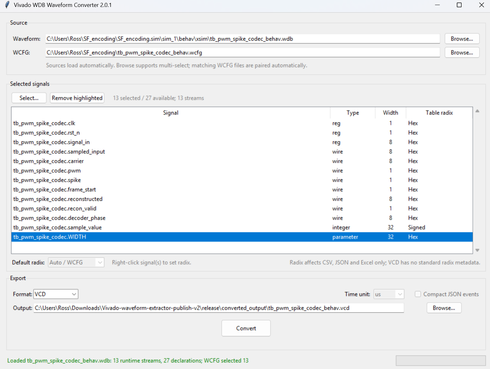
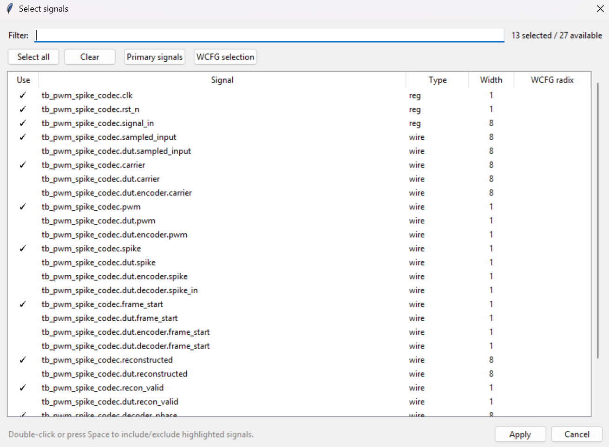
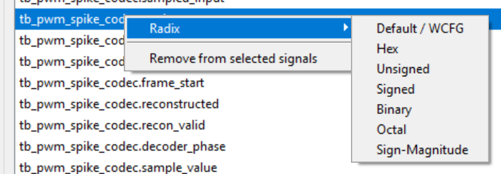

  

# Vivado WDB Waveform Converter

Convert AMD Vivado/XSim **WDB and WCFG waveform databases directly to VCD, CSV, JSON and Excel** without rerunning the simulation.

The converter also handles **VCD-to-CSV/JSON/Excel workflows, batch conversion, signal filtering, per-signal radix selection, SystemVerilog and VHDL waveform types**.

## Supported conversions

| Input | VCD | CSV | JSON | Excel |
|---|:---:|:---:|:---:|:---:|
| WDB | Yes | Yes | Yes | Yes |
| WDB + WCFG | Yes | Yes | Yes | Yes |
| WCFG | Yes | Yes | Yes | Yes |
| VCD | - | Yes | Yes | Yes |

WDB/WCFG input defaults to **VCD**. VCD input defaults to **CSV**.

## Features

- Native Vivado/XSim `.wdb` decoding
- Optional `.wcfg` signal-selection and radix metadata
- VCD, CSV, JSON and Excel export
- Multiple-file batch conversion
- Automatic unambiguous WDB/WCFG pairing
- Full hierarchical signal names
- Right-click per-signal radix selection
- WCFG-derived radix defaults
- Wide vectors and X/Z state preservation
- SystemVerilog `real`
- Packed and unpacked arrays
- Multidimensional arrays
- VHDL scalar, vector, array, record, integer, time and real types
- Mixed SystemVerilog/VHDL simulations
- Background GUI conversion
- CLI and GUI operation
- Standalone builds for Windows, Linux and macOS

Get the latest release from [here](https://github.com/Ross0907/Vivado-WDB-Waveform-Converter/releases).

## Standalone applications

Prebuilt standalone applications are available from the GitHub Releases page.

### Windows x64

    VivadoWDBWaveformConverter-v2.0.1-Windows-x64.exe

### Linux x64

    VivadoWDBWaveformConverter-v2.0.1-Linux-x64

### Linux ARM64

    VivadoWDBWaveformConverter-v2.0.1-Linux-arm64

Linux builds may need the executable bit set after downloading:

    chmod +x VivadoWDBWaveformConverter-v2.0.1-Linux-x64

### macOS Intel

    VivadoWDBWaveformConverter-v2.0.1-macOS-Intel.dmg

### macOS Apple Silicon

    VivadoWDBWaveformConverter-v2.0.1-macOS-AppleSilicon.dmg

The standalone applications include the required Python runtime and dependencies, so Python does not need to be installed on the target system.

Matching SHA-256 checksum files are provided with the release binaries.

### Default output location

When running a standalone build, conversions are written by default to:

    <folder containing the application>\converted_output\

When running directly from source, the default `converted_output` folder is beside `waveform_converter.py`.

## Quick start

### WDB to VCD

    python waveform_converter.py simulation.wdb

or explicitly:

    python waveform_converter.py simulation.wdb --vcd

### WDB + WCFG

    python waveform_converter.py simulation.wdb simulation.wcfg --vcd

A WCFG can also be supplied directly when its associated WDB can be resolved:

    python waveform_converter.py simulation.wcfg --vcd

### Other formats

    python waveform_converter.py simulation.wdb --csv
    python waveform_converter.py simulation.wdb --json
    python waveform_converter.py simulation.wdb --excel

Existing VCD files:

    python waveform_converter.py waveform.vcd --csv
    python waveform_converter.py waveform.vcd --json
    python waveform_converter.py waveform.vcd --excel

## Batch conversion

Multiple WDB and WCFG files can be selected at once from the GUI.

Command-line example:

    python waveform_converter.py run1.wdb run1.wcfg run2.wdb run2.wcfg --vcd

The converter pairs WCFG files with WDB files only when the mapping is unambiguous.

## Signal selection and radix

List signals:

    python waveform_converter.py simulation.wdb --signals

Filter signals:

    python waveform_converter.py simulation.wdb --csv --include "*data*" --exclude "*internal*"

In the GUI, right-click one or more highlighted signals to select the radix. Available formats include binary, octal, hexadecimal, unsigned decimal, signed decimal and signed magnitude. `Default / WCFG` returns the signal to its WCFG/default setting.

Radix affects CSV, JSON and Excel presentation. VCD remains standards-compliant and radix-neutral.

## Native WDB reader

The characterized WDB profile currently targets databases containing:

    Xilinx WAVE DATABASE 01
    Xilinx ISim DBG 006

The reader uses embedded waveform event data, debug metadata and runtime type information. Unsupported or ambiguous structures are rejected instead of being guessed.

See `WDB_FORMAT_NOTES.md` for format details.

## Live Vivado VCD capture

`extract_waveform.tcl` remains available for users who prefer live VCD recording from XSim.

With an active simulation:

    Tools -> Run Tcl Script -> extract_waveform.tcl

Direct WDB conversion does not require the Tcl helper and does not rerun the simulation.

## Running from source

Python 3.10 or newer is recommended.

Install dependencies:

    python -m pip install -r requirements.txt

Launch the GUI:

    python waveform_converter.py

or:

    pythonw waveform_converter.pyw

## Building release binaries

Multi-platform release builds are handled by GitHub Actions using native runners for each supported operating system and architecture.

The workflow builds and uploads standalone release files for:

- Windows x64
- Linux x64
- Linux ARM64
- macOS Intel
- macOS Apple Silicon

The workflow is located at:

    .github/workflows/build-multiplatform-release.yml

It can be started from the GitHub Actions page, or from PowerShell using:

    .\BUILD_MULTIPLATFORM_RELEASE.ps1

For example:

    .\BUILD_MULTIPLATFORM_RELEASE.ps1 -ReleaseTag v2.0.1

The build helper triggers the workflow, waits for all platform builds to complete and verifies that the expected release assets were uploaded.

The existing Windows-only local builder is also available:

    BUILD_WINDOWS_EXE.bat

## Project structure

    Vivado-WDB-Waveform-Converter/
    |
    |-- waveform_converter.py
    |-- waveform_converter.pyw
    |-- vcd_converter.py
    |-- vcd_converter.pyw
    |-- CONVERT_WAVEFORM.bat
    |-- LIST_SIGNALS.bat
    |-- BUILD_WINDOWS_EXE.bat
    |-- BUILD_MULTIPLATFORM_RELEASE.ps1
    |-- extract_waveform.tcl
    |-- WDB_FORMAT_NOTES.md
    |-- CHANGELOG.md
    |-- requirements.txt
    |-- LICENSE
    |
    |-- .github/
    |   `-- workflows/
    |       `-- build-multiplatform-release.yml
    |
    `-- images/
        |-- logo.svg
        |-- mainwindow.png
        |-- signalselect.png
        `-- radix.png

## Legacy compatibility

The original `vcd_converter.py` and `vcd_converter.pyw` entry points remain available for existing VCD conversion workflows.

## License

MIT License. See `LICENSE`.
